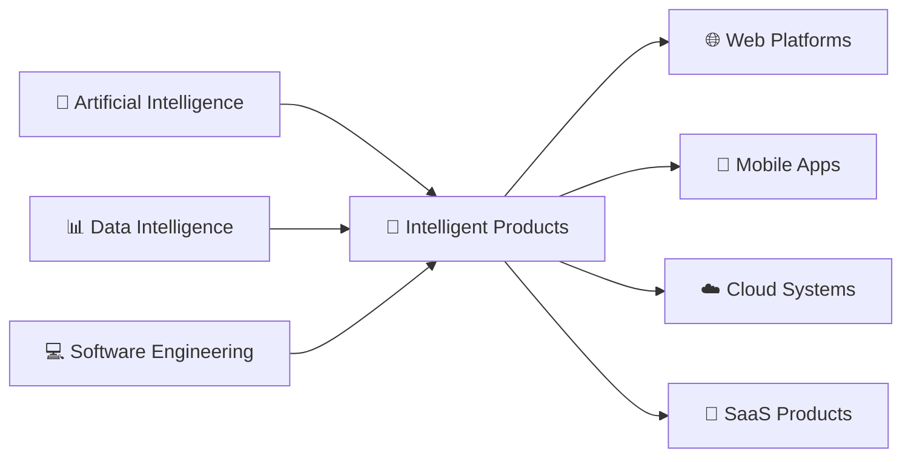
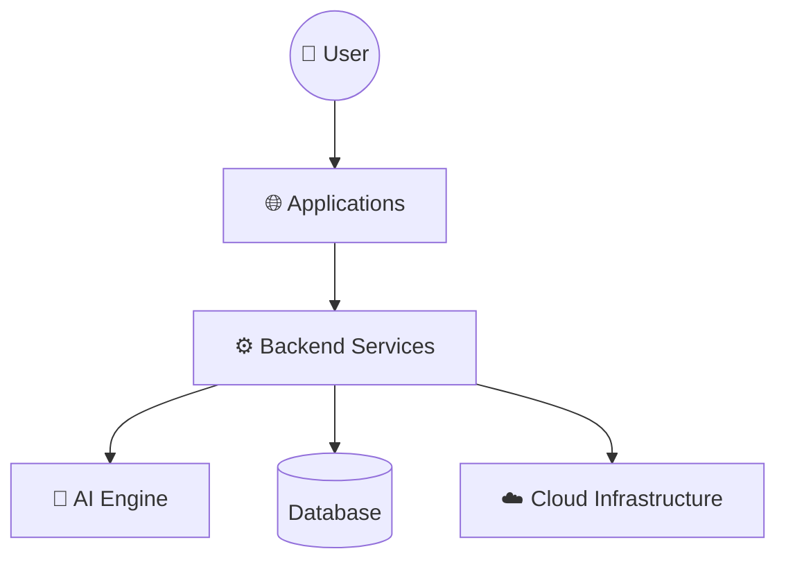
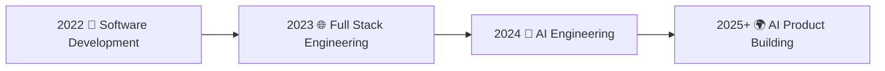

<div align="center">


<br/>


<br/><br/>


<br/><br/>


</div>


---

# 🧠 WHO AM I?


<table>
<tr>

<td width="60%">


## Mohammad Taheri

### AI Product Engineer


I create intelligent software products by combining:


```
Artificial Intelligence

        +

Software Architecture

        +

Modern Engineering

        +

Product Thinking
```


My mission:

> Build scalable technology that creates real-world impact.


</td>


<td width="40%">


```yaml
PROFILE:

role:
  - AI Engineer
  - Software Architect
  - Product Builder


FOCUS:

  - Computer Vision
  - Machine Learning
  - LLM Systems
  - SaaS Architecture


VISION:

  "Build the future
   with intelligent systems"
```


</td>


</tr>
</table>


---

# ⚡ ENGINEERING DNA


<div align="center">





</div>


---


# 🚀 FEATURED PRODUCTS


<table>

<tr>


<td width="33%">


## ✨ BeautyAI


### AI Beauty Intelligence


```
Computer Vision

+

AI Generation

+

Face Analysis
```


Status:

🟢 Building


</td>


<td width="33%">


## 🏥 MedLink


### Healthcare AI Platform


```
Clinic System

+

Medical Data

+

AI Assistance
```


Status:

🟢 Building


</td>


<td width="33%">


## ⚡ LifeOS


### Personal AI OS


```
Planning

+

Habits

+

AI Assistant
```


Status:

🟢 Building


</td>


</tr>

</table>


---


# 🏗 SYSTEM ARCHITECTURE





---


# 🧩 TECHNOLOGY UNIVERSE


<div align="center">


</div>


<br/>


## 🧠 Artificial Intelligence


```
Machine Learning

Deep Learning

Computer Vision

NLP

LLM Applications

AI Agents

Data Processing
```


## 🌐 Software Engineering


```
Next.js

React

TypeScript

Node.js

GraphQL

Microservices

REST API
```


## ☁️ Infrastructure


```
Docker

Linux

Nginx

Cloud

CI/CD

Distributed Systems
```


---


# 🛠 BUILDING PROCESS


<div align="center">


```
        IDEA

          ↓

    ARCHITECTURE

          ↓

        CODE

          ↓

    INTELLIGENCE

          ↓

       PRODUCT

          ↓

        IMPACT

```


</div>


---


# 📈 ENGINEERING JOURNEY





---


# 🎯 CURRENT MISSION


<div align="center">


## Building AI Products That Matter


</div>


```json
{

"building":[

"BeautyAI",

"MedLink",

"LifeOS",

"KPM CLI"

],


"research":[

"Artificial Intelligence",

"Computer Vision",

"LLM",

"AI Agents"

],


"vision":

"Create globally scalable intelligent technology"

}
```


---


# 📊 GITHUB ANALYTICS


<div align="center">


<br/><br/>


</div>


---


# 🌎 CONNECT


<div align="center">


<a href="https://github.com/mohammadtaheri">


</a>


<a href="https://linkedin.com">


</a>


</div>


---


<div align="center">


## ⚡ BUILD

## 🧠 CREATE

## 🚀 SCALE


<br/>


</div>
