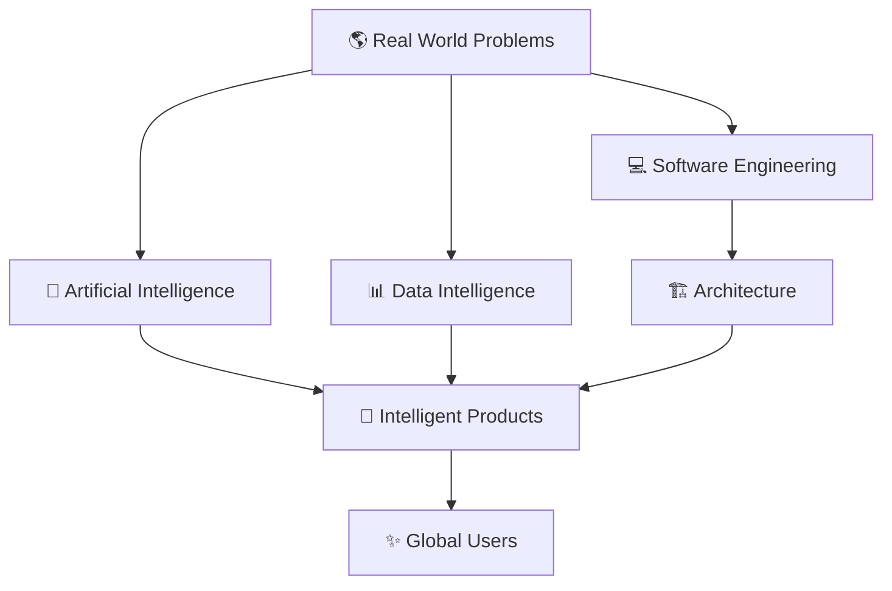
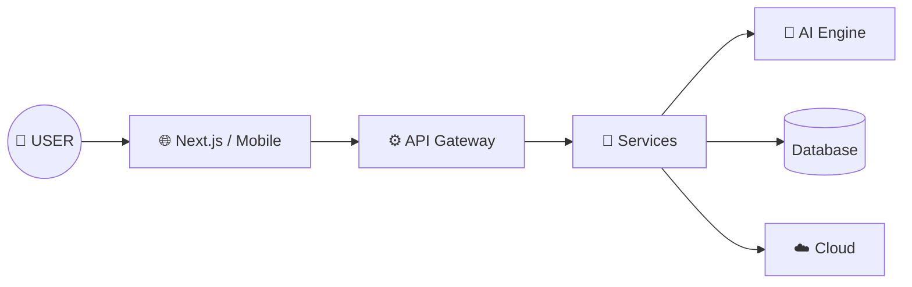

<div align="center">


<br>


<br><br>


</div>


<br>


<div align="center">


## 🧠 Creating Intelligent Products

```
AI  +  Architecture  +  Engineering  =  Impact
```

</div>


---


# 🪐 Identity Card


<table>

<tr>


<td width="50%">


<br><br>


I design and build:

<br>


🧠 AI Systems

<br>

🌐 Scalable Platforms

<br>

📱 Intelligent Applications

<br>

☁️ Cloud Infrastructure


</td>


<td width="50%">


<br><br>


```yaml
Currently:

building:
  - BeautyAI
  - MedLink
  - LifeOS

research:
  - Computer Vision
  - LLM
  - AI Agents

mission:
  Build the future
```


</td>


</tr>

</table>


---


# 🧬 Neural Engineering DNA


<div align="center">





</div>


---


# 🚀 Product Universe


<table>


<tr>


<td align="center" width="33%">


# ✨ BeautyAI


<br><br>


🧠 Face Understanding

<br>

🎨 AI Simulation

<br>

👁 Computer Vision


<br><br>


```
Image
 ↓
AI Model
 ↓
Result
```


</td>


<td align="center" width="33%">


# 🏥 MedLink


<br><br>


🏥 Clinic System

<br>

🧬 Medical Data

<br>

🤖 AI Assistant


<br><br>


```
Patient
 ↓
Doctor
 ↓
AI
```


</td>


<td align="center" width="33%">


# ⚡ LifeOS


<br><br>


🎯 Goals

<br>

🔥 Habits

<br>

📅 Planning


<br><br>


```
Life Data
 ↓
AI
 ↓
Better Life
```


</td>


</tr>


</table>


---


# 🏗 Cloud + AI Architecture


<div align="center">





</div>


---


# 🧪 AI Research Lab


<div align="center">


<table>

<tr>

<td>

🧠 Machine Learning

</td>


<td>

👁 Computer Vision

</td>


<td>

🤖 LLM Agents

</td>


<td>

⚡ Automation

</td>


</tr>

</table>


</div>


---


# 🛠 Technology Galaxy


<div align="center">


</div>


<br>


<table>

<tr>

<td>


## AI CORE

```
Python
PyTorch
TensorFlow
OpenCV
LLM
ML
DL
```


</td>


<td>


## SOFTWARE

```
Next.js
React
TypeScript
Node.js
GraphQL
Microservices
```


</td>


<td>


## CLOUD

```
Docker
Linux
Nginx
AWS
CI/CD
Distributed Systems
```


</td>


</tr>

</table>


---


# 📡 Developer Dashboard


<div align="center">


<br>


</div>


---


# 🐍 Contribution Activity


<div align="center">


</div>


---


<div align="center">


# ⚡ BUILD

# 🧠 THINK

# 🚀 SCALE


<br>


</div>
